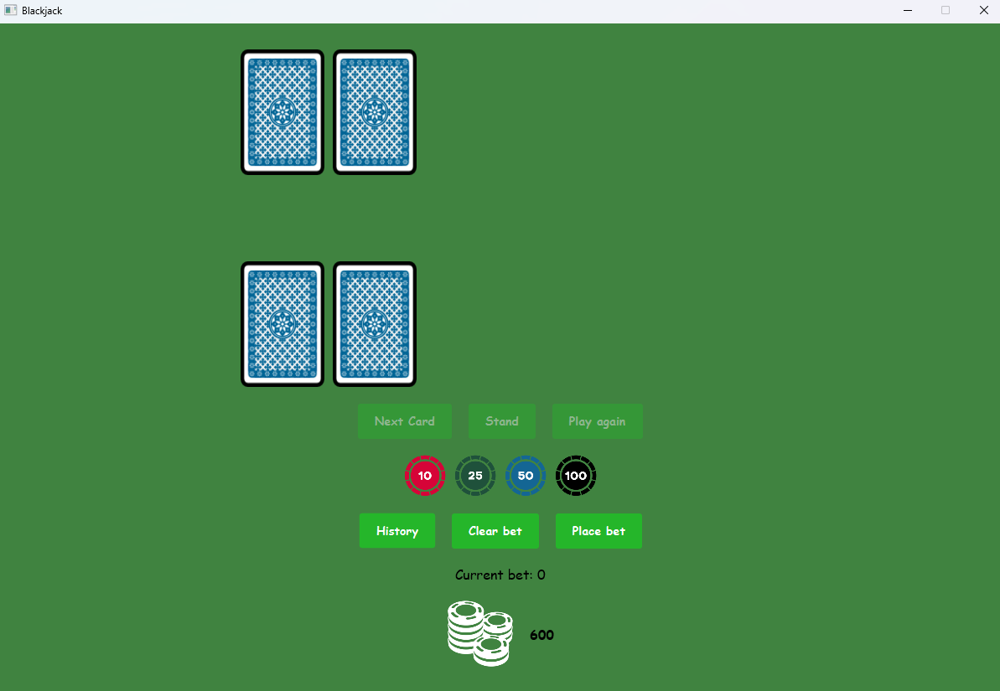
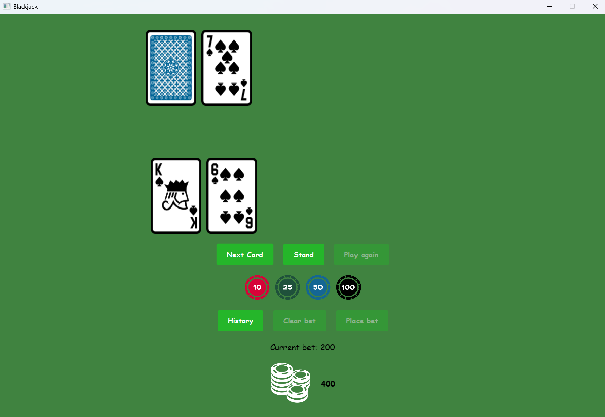

<h2>Blackjack Game in JavaFX ♠️</h2>

This project is an implementation of the classic card game Blackjack, developed using JavaFX. It allows players to compete against the dealer while placing bets, providing an engaging and interactive user experience. The project leverages design patterns such as Singleton and Memento to ensure efficient state management and maintainability.

<h2>Key Features</h2>
<ul>
    <li><strong>Single-player gameplay against the dealer:</strong> Players can make strategic decisions like hitting, standing, and betting.</li>
    <li><strong>Betting system:</strong> Players can place bets and manage their balance during the game.</li>
    <li><strong>History tracking:</strong> Displays the player's balance history, allowing them to review their betting progress.</li>
    <li><strong>Modern UI:</strong> A user-friendly interface designed with JavaFX and customizable styles using CSS.</li>
</ul>

  
  

<h2>Technology Stack</h2>
<ul>
    <li><strong>JavaFX</li>
    <li><strong>CSS</li>
</ul>

